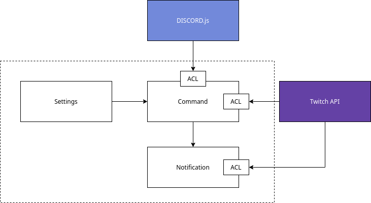

# DDD Notes

- [Ubiquitous Language](#ubiquitous-language)
- [Use Cases](#use-cases)
- [Context Map](#context-map)

# Ubiquitous Language

## Server

>  Discord server, read more about [discord.com](https://discord.com/)

## Channel

>  Server text channel

## User

>  Anyone that has access to channels

## Owner

>  User that created the server

## Moderator

>  Roles that can interact with app settings, have less privilege than owner

## Command

>  Messages directed to the app by users

## Streamer

>  Twitch user, read more about [twitch.tv](https://twitch.tv/)

## Notification

>  App messages triggered by some twitch event

# Use Cases

## v0.1.0

- [ ] A notification should be sent whenever a streamer goes live
- [ ] Notifications should be sent to general channel

## v0.2.0

- [ ] Only privileged users (user is owner or has moderator) can access settings commands
- [ ] Only owners can add moderators
- [ ] Notification channel can be changed

## v0.3.0

- [ ] Notifications should mention related roles
- [ ] Notifications related roles can be changed

## v0.4.0

- [ ] App should show command status with emoji reactions

## v0.5.0

- [ ] App should respond to private messages
- [ ] Private messages must specify server

## v0.6.0

- [ ] App should manage server roles
- [ ] Users can subscribe for notifications
- [ ] User emoji reaction can trigger commands

## v0.7.0

- [ ] User can ask for streamers list
- [ ] User can ask for streamer status

# Context Map

